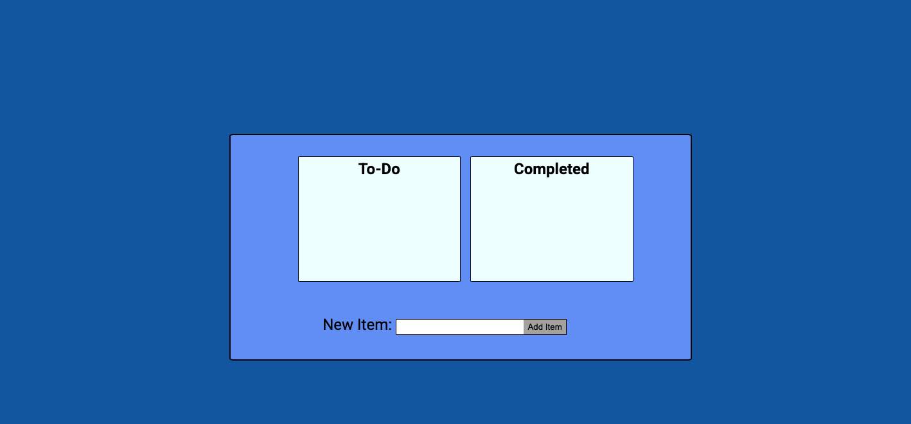

# To-Do List

### Simple to do list that allows an input to be created as a list item and is added to a "To-Do" list.When clicked, the item will be removed from the "To-Do" list and moved to a "Completed" list. This is made by using HTML, CSS, and JavaScript concepts.

### I made this project to help practice new JavaScript principles I just learned and also to refresh my HTML and CSS skills.

